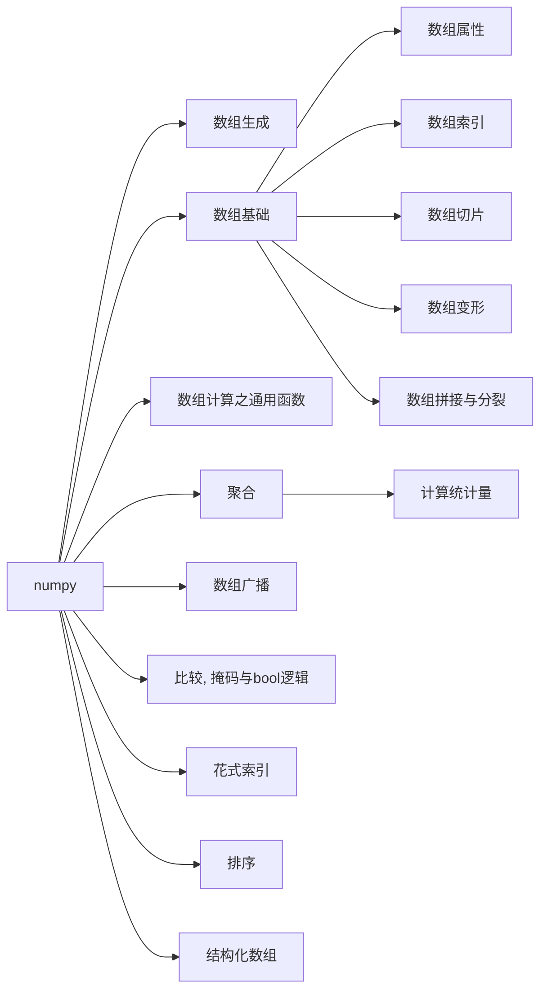
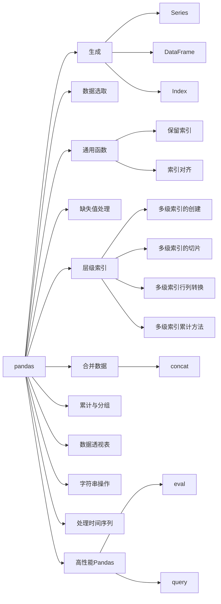

```mermaid
graph LR
a[numpy]
a-->b[数组生成]
a-->c[数组基础]
	c-->d[数组属性]
	c-->e[数组索引]
	c-->f[数组切片]
	c-->g[数组变形]
	c-->h[数组拼接与分裂]
a-->i[数组计算之通用函数]

a-->j[聚合]
	j-->计算统计量

a-->k[数组广播]
a-->l[比较, 掩码与bool逻辑]
a-->m[花式索引]
a-->n[排序]
a-->o[结构化数组]


```

```mermaid
graph LR
p[pandas]-->q[生成]
q-->Series
q-->DataFrame
q-->Index
p-->r[数据选取]
p-->s[通用函数]-->保留索引
s-->索引对齐
p-->t[缺失值处理]
p-->u[层级索引]
	u-->多级索引的创建
	u-->多级索引的切片
	u-->多级索引行列转换
	u-->多级索引累计方法
p-->v[合并数据]
	v-->concat

p-->w[累计与分组]
p-->x[数据透视表]
p-->y[字符串操作]
p-->z[处理时间序列]
p-->aa[高性能Pandas]
	aa-->eval
	aa-->query

```
