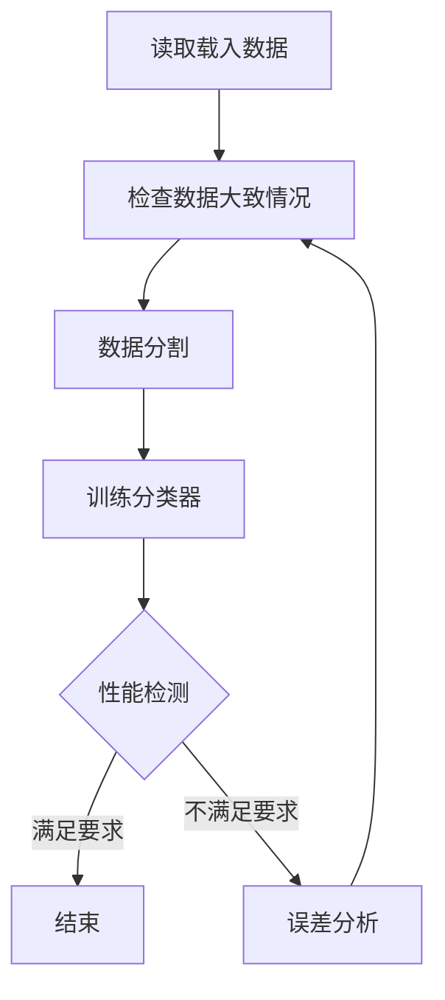
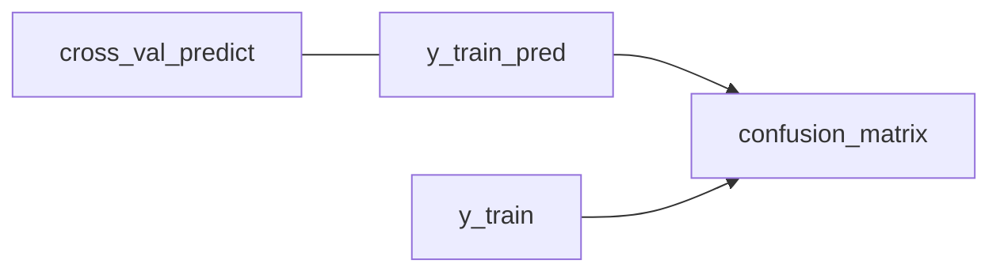

***
>1.模型的性能测试
>2.更复杂的分类器：多类分类器、多标签分类器、多输出分类器
# 1.大致的流程


# 2.性能测量

## 交叉验证

k折交叉验证指的是，将数据集分为k折，其中一折用于预测，其余的用于训练。

非常有趣的是，交叉验证的预测结果输出是每一折的预测结果，而且这个结果是干净的。相当于，我们用了3折数据训练，并且生成了这3折的干净预测数据。

之所以要用`K折`来交叉验证就是为了：在进行多次预测的同时，保证每次训练和预测的数据都是从未见过的。

我们通过预测的准确率来评估模型的好坏。但是需要注意的是，准确率在对于有偏的数据集上并没有太强大的作用。所以，准确度难以成为分类器的首选指标。

比如对于一群手写数字，我要预测数字是否是‘非5’。很明显，我们既是瞎猜都有90%的概率认为是非5。这显然是有偏的。

## 混淆矩阵

混淆矩阵用于性能测试的核心思想是统计A类被误判为B类的次数。下方是一个简单的混淆矩阵示意图：
$$
\begin{equation*} \begin{bmatrix} \text{True Positives (TP)} & \text{False Negatives (FN)} \\ \text{False Positives (FP)} & \text{True Negatives (TN)} \end{bmatrix} \end{equation*}
$$
这是一个二元分类的混淆矩阵。其中，列代表了预测的类别，而行代表了实际的类别。

>比如：其中的`FN`就代表`实际是P类型但是被错误的预测为N`

接下来将介绍如何使用混淆矩阵进行性能测试。我们为了不使用测试数据而进行性能测试，我们依旧需要参照交叉验证的思想。使用交叉验证返回一组K折预测值。然后把实际分类与预测类别放进`confusion_matrix`中。

>图中的`y_train`表示一个bool列表

定义准确率（精度）与召回率（灵敏度）如下:
$$
精度 = \frac{TP}{TP+FP}
$$
$$
召回率 = \frac{TP}{TP+FN}
$$
在`sklearn.matrix`中，提供了`precision_score`, `recall_score`来计算精度和召回率。

## 精度与召回率的合成

使用F1分数来将两个指标进行合成
$$
F_{1} = \frac{2}{\frac{1}{精度}+\frac{1}{召回率}} = \frac{TP}{TP+\frac{FN+FP}{2}}
$$
在实际运用中，往往鱼与熊掌不可兼得，当然我们可能关心的方面也不同。比如对于儿童健康视频的识别，我们宁可召回率低一些也要保证较高的精度。而在罪犯识别系统，我们宁可精度低一些也要保证较高的召回率。

在`sklearn.matrix`中我们使用`f1_score()`来获取F1分数。

## PR曲线（精度与召回率的权衡）

在我们想要精度与召回率都不错的情况下，我们也许要对二者做一个权衡。在之前的情况，我们都是直接获取到预测的结果。但是其实在分类器中，它是通过决策函数来计算每个x的分值，而后根据分值与`阈值`的大小关系来进行分类。阈值的调整会使得精度与召回率发生变动。

有两种方法可以获取到分数：

1. `model.decision_function(test_data)`
   使用`predict()`获取的是根据阈值做出的结果。我们用`decision_function()`代替`fit()`因获得分数`y_score`。记住在使用前需要做fit。
   
2. `cross_val_predict(model, x_train, y_train, cv=3, method = 'decision_function')`
   这个方法的好处在于没有使用测试数据，并且不用提前做fit。这个函数返回测试集的决策函数值`y_score`。

获得`y_score`后，我们的当务之急就是确定一个我们喜欢的阈值。我们使用`precision_recall_predict(y_train, y_score)`，返回值是精度，召回率，阈值。我们使用这三者做出图片如下：

![[精确度与召回率.png]]
>图中有一个有趣的现象，那就是精度的上升明显会更崎岖。这是为什么呢？因为在阈值上升过程中，精度不单会上升，也有可能会出现下降的情况，而召回率一定是下降的。

具体来说，如果我们需要比如90%的精度，那么阈值怎么确定呢？我们使用的是如下代码：
```python
threshold_90_precision = threshould[np.argmax(precision>=90)]
```

## ROC 曲线

ROC曲线绘制的是真正类率和假正类率的关系，其中真正率与假正率的计算公式如下
$$
\begin{aligned}
&真正类率(TPR) = \frac{TP}{TP+FN} \\
&假正率(FPR) = \frac{FP}{TN+FP}
\end{aligned}
$$
在python代码中，使用代码`sklearn.matrix`中的`roc_curve(y_train, y_score)`返回FPR，TPR，threshould。用前2个指标绘制的图片如下：
![[ROC曲线.png]]
ROC曲线离直线越远越好。如何衡量远近呢？我们采用的是 **曲线下面积(AUC)** 来衡量。完美分类器的面积是1，随机分类器的面积是0.5.

在python中使用代码`sklearn.matrix`中的`roc_auc_score(y_train, y_score)`获取AUC的值。

>PR曲线与RPC曲线怎么选择呢？
>>当数据中正类实例较少，或者我们更关注的是假正类而非假负类的时候，我们倾向选择FP曲线。
>>反之则选择ROC曲线

# 3.多类分类器

实现多类分类一般有两种途径：
>1.某些算法本身就可以处理多类分类器
>2.通过使用一些**策略**使得严格的二元分类器实现多类分类器


## 用严格二元分类器构建多类分类器的方法

多类分类问题可以通过使用严格二元分类器来解决。下面介绍两种常用的策略：

1.  OvR (one vs rest)：这个策略对于每个类别都建立一个二元分类器。在分类时，每个分类器给数据打分，然后将每个分类器的得分归一化，使其和为1，表示数据属于每个类别的概率。我们选择得分最高的类别作为分类结果。
    
2.  OvO (one vs one)：这个策略对于每两个类别之间都建立一个二元分类器。所有分类器对数据都做出了分类之后，出现次数最多者为最终分类结果。
    

当某种算法（比如SVM）在数据量扩大后，表现会变得糟糕。这时候可以使用OvO策略。

# 4.误差分析

在选择了一个具有潜力的模型之后，我们需要对这个模型进行误差分析。以下是误差分析的步骤：

1.  制作混淆矩阵：在此处，我们需要知道模型在识别数字时的误差情况，相当于每一种数字被识别为其他数字的概率。然后每行除以行的总和，表示错误率。
    
2.  观察其中的规律，对于容易被错分的数字类型，搜集更多的数据，也可以开发一些算法来识别特定的数据。
    

# 5.多标签分类

对于标签数据，我们可以有多个标签。比如对于数字识别任务，不仅需要识别数字标签，还需要识别数字的写法是哪种风格。更具体的任务是手机相册的人脸识别。手机相册的照片会有很多人脸出现在一张照片中。能够准确识别照片中出现的人脸标签是很重要的。

## 多标签分类问题的评价

对于多标签分类问题的评价，可以采用之前所提及的几个指标。对于每个标签使用指标进行评价后，计算平均值。每个标签的重要性可能不一样，照片中出现次数较多的人，可能希望在某方面的识别有着更好的性能。在指标计算的过程中，可以对参数做如下赋值：`average="weighted"`。

## 多输出问题（泛多标签分类问题）

多输出分类器可以认为是一种泛化的多标签分类器。在多输出问题中，标签是多类的。举一个例子，数字图像噪音去除问题。我们人为给数据加上噪音，训练数据是有噪声数据，其标签是无噪音数据。观察这个问题可以发现，标签有784个，每个标签的值从0-255。

在多输出问题中，可以使用多个二元分类器来预测每个标签的值。常用的算法包括神经网络、决策树和随机森林等。对于每个标签，可以使用适当的评价指标来评估分类器的性能，然后计算平均值作为整体性能的指标。

需要注意的是，在多输出问题中，标签之间可能存在相关性。这种相关性可以通过使用专门的算法来建模，例如条件随机场和贝叶斯网络等。这些算法可以更好地利用标签之间的相关性来提高模型的性能。


