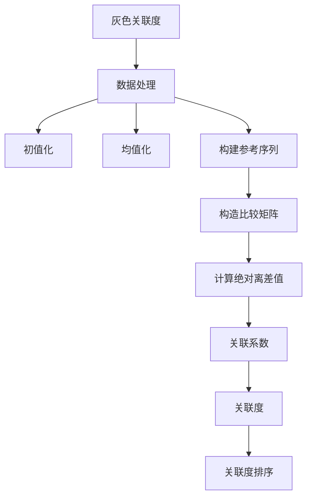

# 1.什么是[[灰色关联度]]评价
灰色关联度综合评价的流程：




# 2.题目以及分析结果
## 题目
![[Pasted image 20230424204550.png]]
## 分析结果
将表格输入到代码中, 得到如下结果, 结果按照灰色关联度自上而下排列:

|   # |    Value |
| ---:| --------:|
|   3 | 0.712485 |
|   6 | 0.682004 |
|   5 | 0.677394 |
|   1 | 0.663909 |
|   2 | 0.567158 |
|   4 | 0.538200 |

**结果表明**：6位老师按照灰色关联度排名的结果为3>6>5>1>2>4.
# 代码附录
## 数据预处理(同向化与无量纲化)
```Python
""" 这个文件旨在对指标数据进行预处理。包含指标同向化与无量纲化的函数 """  
class DataPretreatment:  
    """ 数据预处理函数，将数据进行同向化与无量纲化 """    
    def __init__(self, data, result=None, do_forward=False, do_normalize=False):  
        self.data = data  
        self.result = result  
        self.do_forward = do_forward  
        self.do_normalize = do_normalize  
  
    def apply_forward(self, data):  
        """ 同向化函数，将数据转换为正向数据 """        
        if self.do_forward:  
            data = data.apply(lambda x: 1/x)  
        else:  
            data = data  
        return data  
  
  
    def apply_normalize(self, data):  
        """ 无量纲化函数，将数据转换为无量纲数据 """        
        if self.do_normalize:  
            m = data.max()  
            data = data.apply(lambda x: x/m)  
        return data  
  
    def pretreatment(self):  
        """ 执行同向化函数 """        
        data = self.apply_forward(self.data)  
        data = self.apply_normalize(data)  
        self.result = data
```
## 灰色关联度评价模型
```Python
import numpy as np  
import pandas as pd  
  
from common.data_pretreatment import DataPretreatment  
  
  
class GrayCorrelation:  
    """  
    灰色关联度综合评价分析法
    """    
    def __init__(self, data, target=None, transpose=False, rho=0.5, result=None):  
        self.data = np.array(data)  
        self.target = target  
        self.transpose = transpose  
        self.rho = rho  
        self.result = result  
  
    def make_target(self):  
        """ 生成目标函数 """        
        if self.transpose:  
            self.data = self.data.T  
  
        dmax = (self.data).max(axis=1)  
        self.target = np.array(dmax)  
  
    def correlation(self):  
        """  
        计算关联系数  
         """        
        self.make_target()  
        data = -(self.data - self.target[:, np.newaxis])  
        dmax = data.max().max()  
        dmin = data.min().min()  
  
        data = pd.DataFrame(data)  
        data = data.apply(lambda x: ((dmin+(self.rho)*dmax)/(x+(self.rho)*dmax)), axis=1)  
        self.result = data.mean(axis=1)  
  
def gray_corr(data, negtive_list=None, positive_list=None, transpose=False, rho=0.5, show=False):  
    """  
    # 计算灰色关联度  
    data: 数据  
    negtive_list: 负向指标列表  
    positive_list: 正向指标列表  
    transpose: 是否转置(默认为False,请保证每行是一个评价对象，每列是一个评价指标)  
    rho: 灰色关联度参数(默认为0.5)  
    show: 是否打印带评价对象名的结果(默认为False)  
    """ 
    a=data  
    if negtive_list!=None:  
        for i in negtive_list:  
            pre = DataPretreatment(a.iloc[:,i], do_forward=True, do_normalize=True)  
            pre.pretreatment()  
            a.iloc[:,i] = pre.result  
  
    if positive_list!=None:  
        for i in positive_list:  
            pre = DataPretreatment(a.iloc[:,i], do_forward=False, do_normalize=True)  
            pre.pretreatment()  
            a.iloc[:,i] = pre.result  
  
    gray = GrayCorrelation(a, transpose=transpose, rho=rho)  
    gray.correlation()  
  
    if show:  
        gray.result.index = data.index  
        gray.result.to_csv('gray.csv')  
        return gray.result  
  
    return gray.result
```
## 输入数据
```Python
import pandas as pd  
  
from gray_analysis import gray_corr  
  
a = pd.DataFrame([[8, 9, 8, 7, 5, 2, 9],  
                  [7, 8, 7, 5, 7, 3, 8],  
                  [9, 7, 9, 6, 6, 4, 7],  
                  [6, 8, 8, 8, 4, 3, 6],  
                  [8, 6, 6, 9, 8, 3, 8],  
                  [8, 9, 5, 7, 6, 4, 8]])  
# rename index  
a.index = [1, 2, 3, 4, 5, 6]  
  
re = gray_corr(a, positive_list=[0, 1, 2, 3, 3, 4, 5, 6], show=True)  
print(re)
```