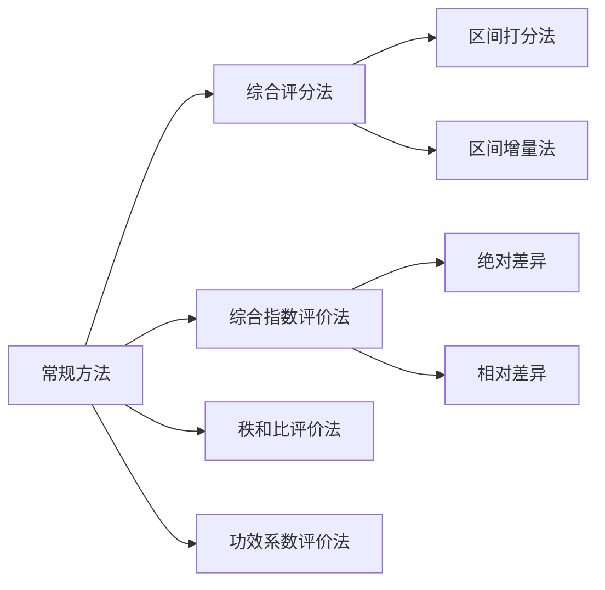
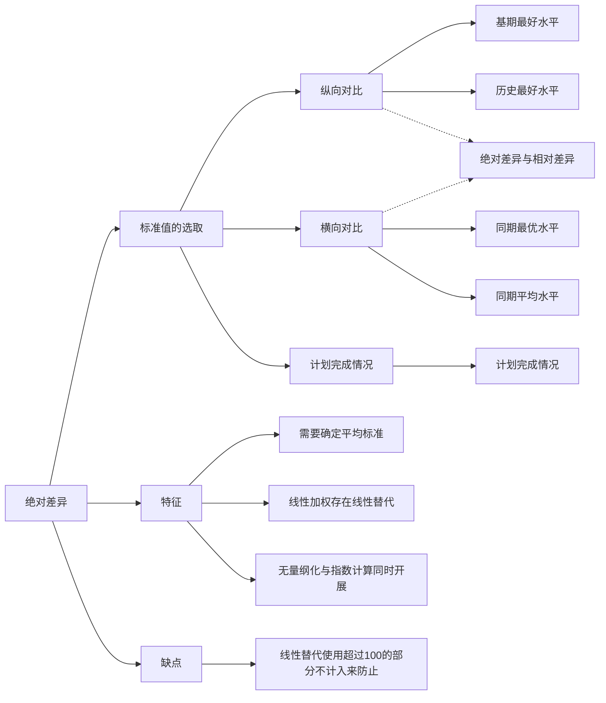

# 1. 汇总

```mermaid
graph LR

a[常规方法]
b[综合评分法]
c[综合指数评价法]
d[秩和比评价法]
e[功效系数评价法]

a-->b
a-->c
a-->d
a-->e

b-->区间打分法
b-->区间增量法
c-->绝对差异
c-->相对差异
```
# 2.综合评分法
## 区间打分法
确定好指标权重以及评分标准后, 进行打分. 最后对每个权重做线性加权.
## 区间增量法
对平均值$x_0$赋一个分数. 以此为基准, 每高出一个D就多打一分.
$$
F = T + \frac{x_{i}- x_0}{D}

$$
# 3.综合指数平均法
用实际值与标准值进行对比后, 再使用线性综合得出总分

```mermaid
graph LR

a[绝对差异]
b[标准值的选取]
c[特征]
d[缺点]
e[纵向对比]
f[横向对比]
g[计划完成情况]
h[绝对差异与相对差异]


a-->b
a-->c
a-->d

	b-->e
	b-->f
	b-->g

		e-->基期最好水平
		e-->历史最好水平
		
		f-->同期最优水平
		f-->同期平均水平
		
		g-->计划完成情况
	
	e-.->h
	f-.->h
	
	c-->需要确定平均标准
	c-->线性加权存在线性替代
	c-->无量纲化与指数计算同时开展
	
	d-->线性替代使用超过100的部分不计入来防止

```

