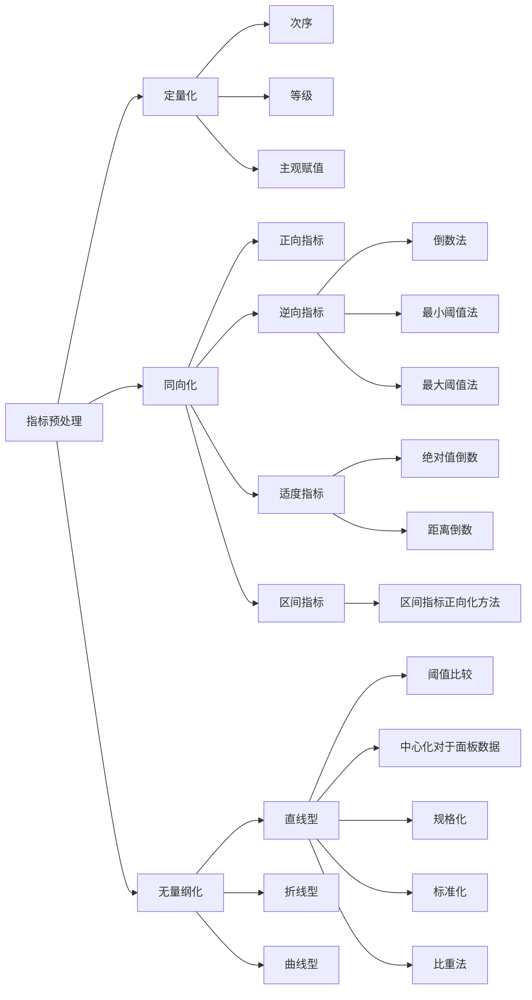
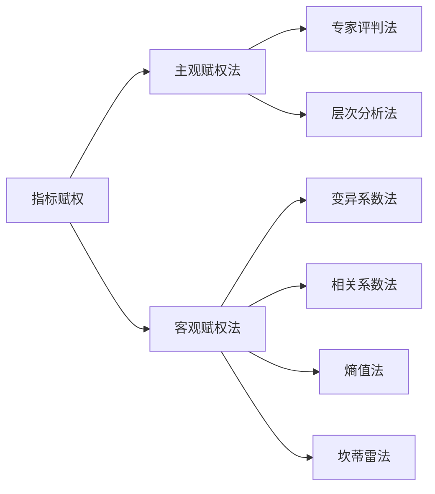
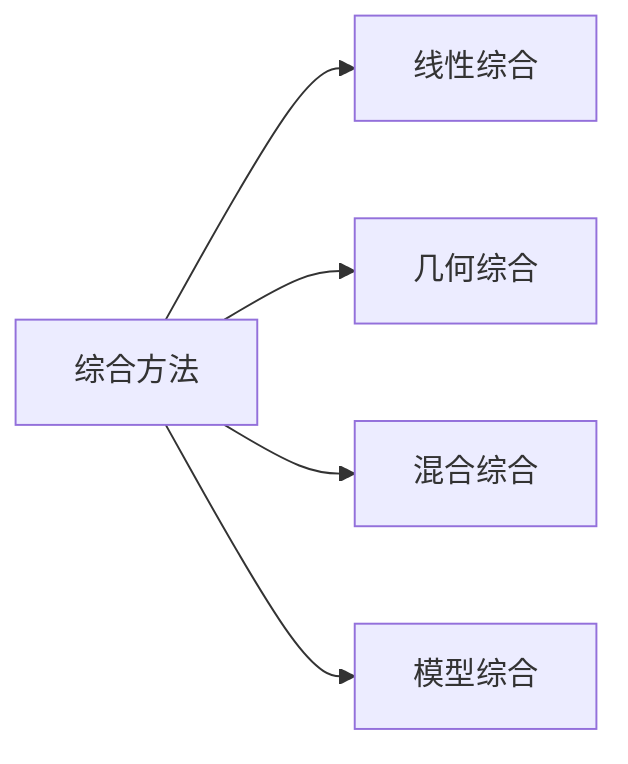
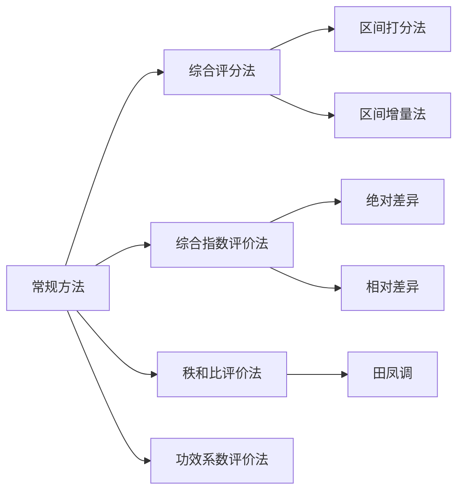
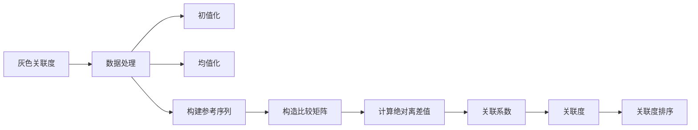

# 1.[[评价指标预处理]]
指标的预处理可以分为三个方面：

```mermaid
graph LR
a[指标预处理]-->b[定量化]
b-->次序
b-->等级
b-->主观赋值

a-->c[同向化]
c-->正向指标
c-->e[逆向指标]
c-->f[适度指标]
c-->g[区间指标]
e-->倒数法
e-->最小阈值法
e-->最大阈值法
f-->绝对值倒数
f-->距离倒数
g-->区间指标正向化方法


a-->d[无量纲化]
d-->h[直线型]
d-->折线型
d-->曲线型
h-->阈值比较
h-->中心化对于面板数据
h-->规格化
h-->标准化
h-->比重法
```
# 2.指标赋权方法

```mermaid
graph LR
a[指标赋权]-->b[主观赋权法]
a-->c[客观赋权法]
b-->专家评判法
b-->层次分析法
c-->变异系数法
c-->相关系数法
c-->熵值法
c-->坎蒂雷法

```
# 3.综合评价数值的综合方法

```mermaid
graph LR
a[综合方法]-->线性综合
a-->几何综合
a-->混合综合
a-->模型综合
```
# 4.[[常规综合评价方法]]

```mermaid
graph LR

a[常规方法]
b[综合评分法]
c[综合指数评价法]
d[秩和比评价法]
e[功效系数评价法]

a-->b
a-->c
a-->d
a-->e
d-->田凤调

b-->区间打分法
b-->区间增量法
c-->绝对差异
c-->相对差异
```
# 5.[[灰色关联度]]

```mermaid
graph LR
灰色关联度-->a[数据处理]
a-->初值化
a-->均值化
a-->c[构建参考序列]
c-->d[构造比较矩阵]
d-->e[计算绝对离差值]
e-->关联系数
关联系数-->关联度
关联度-->关联度排序

```

