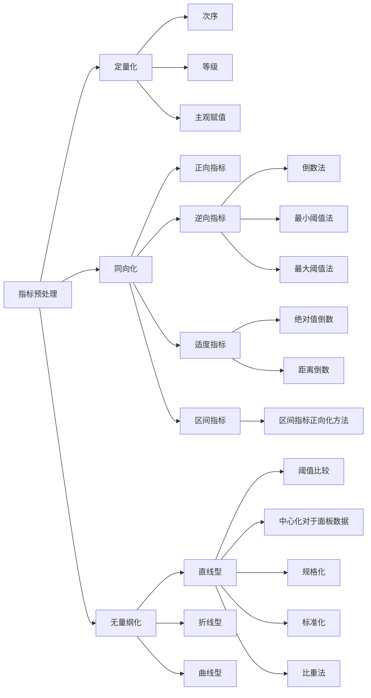

# 1.评价指标预处理的汇总

# 2.同向化
## 逆向指标
**倒数法**
$$
y = \frac{1}{x}
$$
**最小阈值法**
$$
y_1 = \frac{x_{min}}{x_i}
$$
​
**最大阈值法**
$$
y=\frac{x}{x_{\mathbf{max}}}
$$

## 适度指标

**绝对值倒数法**
$$
y = \frac{1}{|x_0-x_i|}
$$
​**距离倒数法**	
$$
y = \frac{1}{\sqrt{x_0-x_i}}
$$

## 区间指标
**区间指标正向化方法**
$$
y_i=
\left\{\begin{array}{lr}
1-\frac{q_1-x_i}{\max \left\{q_1-m, M-q_2\right\}} & x<q_1 
\\
1 & x \in\left[q_1, q_2\right] 
\\
1-\frac{x_i-q_2}{\max \left\{q_1-m, M-q_2\right\}} & x>q_2
\end{array}\right.
$$
# ​3.无量纲化
## 阈值比较法
$$
y = \frac{x}{x_0}
$$
## 中心化法
$$
y = \frac{x}{x_{mean}}
$$

## 规格化
$$
y = \frac{x_i-x_{min}}{x_{max}-x_{min}}
$$
## 标准化
$$
y = \frac{x-x_{mean}}{s}
$$
## 比重法
$$
y = \frac{x_j}{\sum\limits_{i=1}^nx_i}
$$

